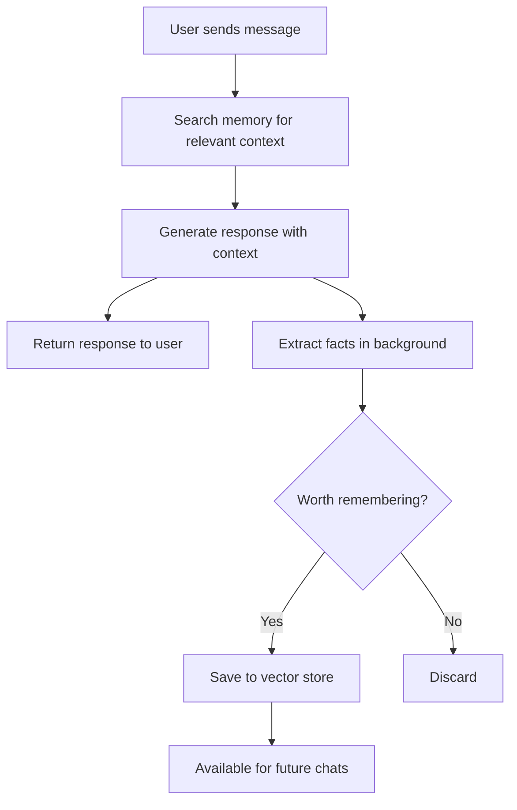

# agent-long-term-memory

[](https://www.python.org/)
[](https://fastapi.tiangolo.com/)
[](https://www.langchain.com/)
[](LICENSE)

A FastAPI chatbot that remembers user preferences and facts across conversations using vector storage.

> [!WARNING]
> This is an experimental project. Memory extraction may not be perfect and can sometimes store incorrect or irrelevant information.

> [!NOTE]
> The chatbot uses FAISS for local vector storage. All memories are stored on disk in the `memory_store/` directory.

---

## 🔄 How It Works


---

## ✨ Current State

### What Works
- [x] Chat endpoint that processes messages
- [x] Automatic extraction of user facts (preferences, personal info, goals)
- [x] FAISS vector storage for persistent memory
- [x] Semantic search to retrieve relevant context
- [x] Structured extraction using Pydantic schemas

### What It Stores
**Saves:**
- Personal preferences (likes/dislikes)
- Personal information (name, location, occupation)
- Allergies and constraints
- Goals and aspirations

**Ignores:**
- Casual conversation
- Temporary requests
- Instructions/knowledge discussed

---

## 🚀 Setup

### Prerequisites
- **uv** package manager → [Installation Guide](https://docs.astral.sh/uv/getting-started/installation/)
- **GROQ API Key** → [Get one here](https://console.groq.com/)

### Installation

**1. Clone the repository**
```bash
git clone https://github.com/devrahulbanjara/agent-long-term-memory
cd agent-long-term-memory/backend
```

**2. Install dependencies**
```bash
uv sync
```

**3. Configure environment**
```bash
cp .env.example .env
# Add your GROQ_API_KEY to .env
```

**4. Run the backend**
```bash
uv run fastapi dev
```

**5. Run the frontend**  
Open the HTML file in your browser

> [!TIP]
> The server runs on `http://localhost:8000` by default. API docs available at `/docs`

---

## 📡 API Usage

### Endpoint
**POST** `/chat`

### Request
```json
{
  "message": "My name is Rahul and I love table tennis"
}
```

### Response
```json
{
  "message": "Nice to meet you, Rahul! Table tennis is a great sport..."
}
```

### What Gets Stored
From the example above:
- `name is Rahul`
- `likes table tennis`

---

## 🏗️ Project Structure
```
.
├── app/
│   ├── core/
│   │   ├── config.py           # Settings & environment
│   │   ├── dependencies.py     # Service initialization
│   │   └── logging_config.py   # Logger setup
│   ├── routes/
│   │   └── chat.py            # Chat API endpoint
│   ├── schemas/
│   │   ├── chat_schemas.py    # Request/Response models
│   │   └── memory_schemas.py  # Memory extraction schema
│   └── services/
│       ├── llm_service.py     # LLM & memory extraction
│       └── memory_service.py  # Vector storage operations
├── main.py                    # FastAPI app entry point
├── memory_store/              # FAISS storage (auto-created)
└── pyproject.toml            # Dependencies
```

---

## 🔮 Roadmap

### Next Steps
- [ ] Memory management endpoints (view/edit/delete)
- [ ] Deduplication of similar facts
- [ ] Fact conflict resolution
- [ ] Memory categorization
- [ ] Conversation history management

### Future Enhancements
- [ ] Memory decay (reduce importance over time)
- [ ] Multi-user support with isolated memories
- [ ] Export/import memory snapshots
- [ ] Analytics dashboard

---

## ⚠️ Known Limitations

> [!CAUTION]
> Be aware of these current limitations:

- **No deduplication** - Similar facts can be stored multiple times
- **No conflict resolution** - Contradicting facts can coexist
- **Memory keeps growing** - No automatic cleanup mechanism
- **LLM-dependent quality** - Extraction accuracy depends on model performance
- **No multi-user support** - Single shared memory store

---

## 🤝 Contributing

Contributions are welcome! Feel free to:
- Report bugs
- Suggest features
- Submit pull requests

---

## 📄 License

MIT License - see [LICENSE](LICENSE) file for details

---

## 🙏 Acknowledgments

Built with:
- [FastAPI](https://fastapi.tiangolo.com/) - Web framework
- [LangChain](https://www.langchain.com/) - LLM orchestration
- [Groq](https://groq.com/) - LLM inference
- [FAISS](https://github.com/facebookresearch/faiss) - Vector similarity search
- [HuggingFace](https://huggingface.co/) - Embeddings model